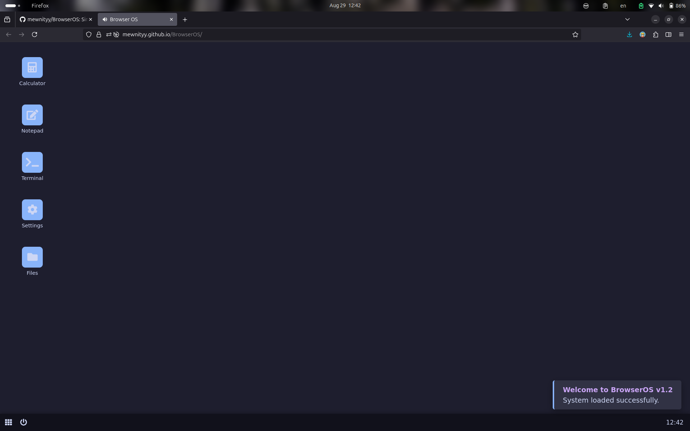

# BrowserOS v1.2

<div align="center">
  
  <br>
  <a href="https://opensource.org/licenses/MIT">
    
  </a>
</div>

## 🚀 Overview

**BrowserOS** is an experimental browser-based operating system built entirely with **HTML**, **CSS**, and **JavaScript**. It runs directly in your web browser, simulating an operating system environment with a minimalist desktop UI and essential applications.

> ⚠️ **Note:** This project is a simulation and is not a replacement for a real operating system.

---

## ✨ Features

- 🖥️ **Desktop Environment**
  - Customizable wallpapers: black, animated, gradient
  - Window management: drag, resize, minimize

- 🔧 **Applications**
  - **Notepad** – for taking quick notes
  - **Terminal** – simple command-line simulation
  - **Calculator** – basic arithmetic operations

- 🎨 **Customization Options**
  - Light/Dark mode toggle
  - Icon color customization

- 📂 **Window Manager**
  - Create folders
  - Multi-window support with draggable and resizable windows

- ⚙️ **Settings Panel**
  - Personalize UI themes and behavior

- 🔄 **Taskbar**
  - Access open applications
  - Start menu simulation

---

## 📺 Demo

Watch the demo video on YouTube:  
[](https://youtu.be/gCIwcJKanVg?si=OKkQ8vy7rvKRz4U7)

---

## 🛠️ Technologies Used

- **HTML** – Structure and layout
- **CSS** – Styling and themes
- **JavaScript** – Application logic and interactivity

---

## 🧩 Planned Features (Upcoming Updates)

- Improved user interface and animations
- Advanced window settings and snapping
- Performance and memory optimizations
- Additional built-in apps

---

## 📁 Installation & Usage

No installation required. Just open the project in your browser:

```bash
git clone https://github.com/mewnityy/BrowserOS.git
cd BrowserOS
open index.html
